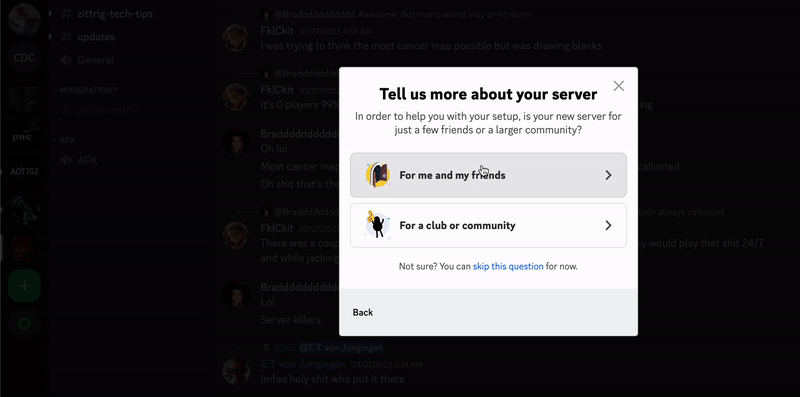
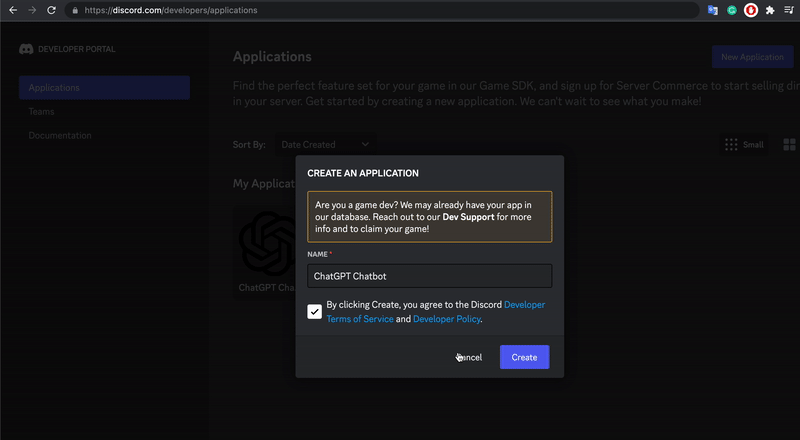
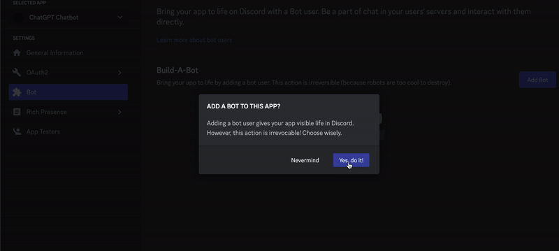
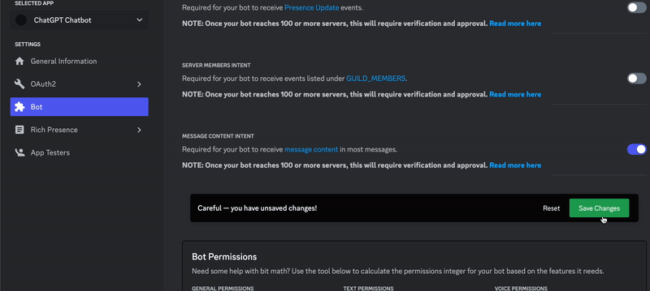
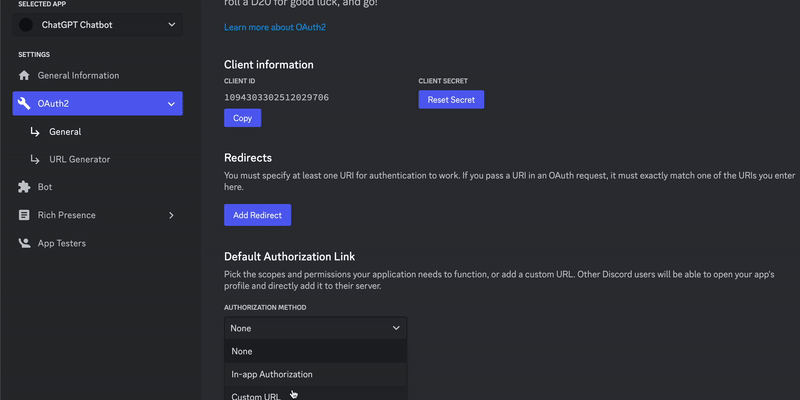
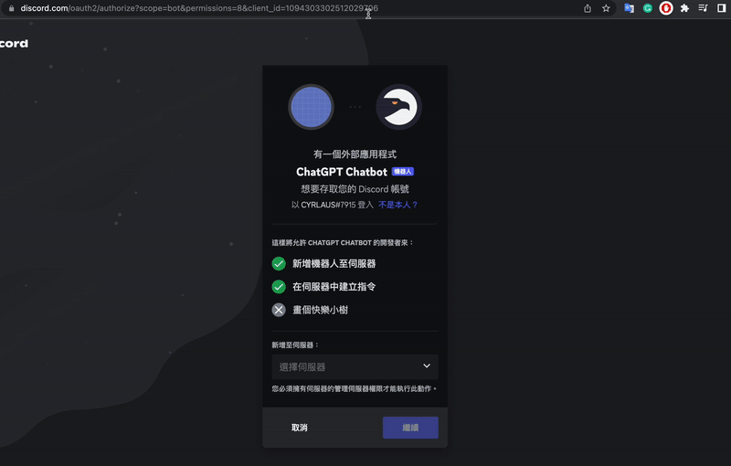
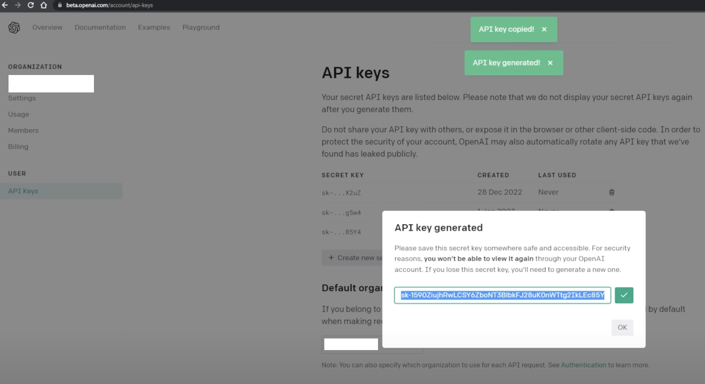
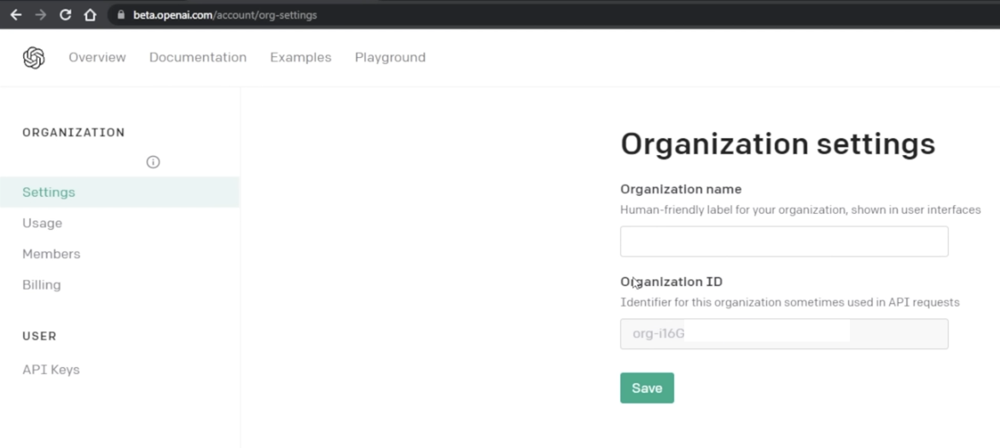

# chatgpt-integration-with-discord

Create a Discord Bot using OpenAI API that interacts on the Discord Server.

# Prerequisite

- Node.js v18+
- npm v8+
- Discord AC
- OpenAI AC

# Step-by-step Tutorial

- Package installation

```bash
cd YOUR_PROJECT_FOLDER_PATH
npm install discord.js openai dotenv
```

- New channel on Discord



- Add Discord App

https://discord.com/developers/applications/



- Add Discord App Bot token



Create .env file in your project folder. Then, add the following code in your .env file in your project folder, and replace the YOUR_DISCORD_BOT_TOKEN.

```bash
DISCORD_TOKEN=YOUR_DISCORD_BOT_TOKEN
OPENAI_ORG=YOUR_TOKEN
OPENAI_KEY=YOUR_TOKEN
```



- Discord App OAuth2 setting

Modify and paste it "https://discord.com/oauth2/authorize?scope=bot&permissions=8&client_id=YOUR_CLIENT_ID"



- Add Discord App Bot to your channel



- OpenAI API keys

https://platform.openai.com/account/api-keys



Replace the OPENAI_KEY in your .env file in your project folder.

- OpenAI Organisation key

https://platform.openai.com/account/org-settings



Replace the OPENAI_ORG in your .env file in your project folder.

- Run Node.js

```bash
cd YOUR_PROJECT_FOLDER_PATH
node index.js
```
